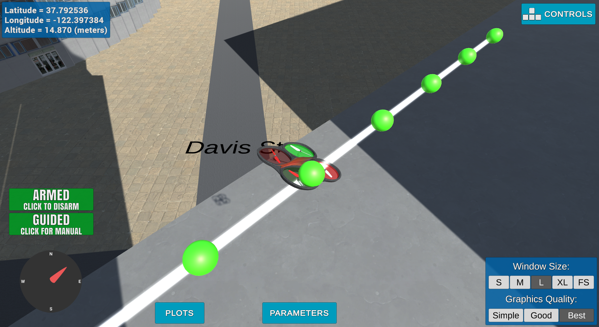
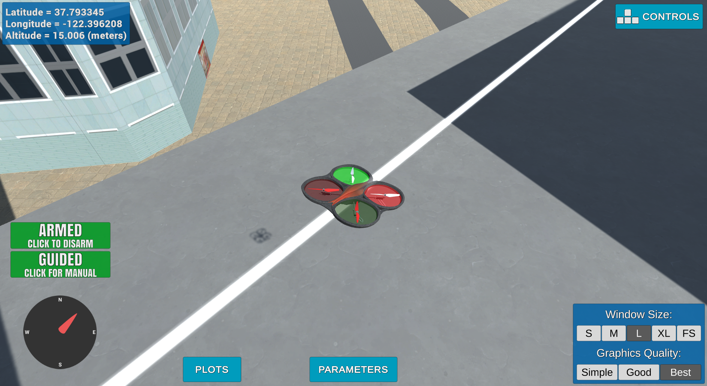
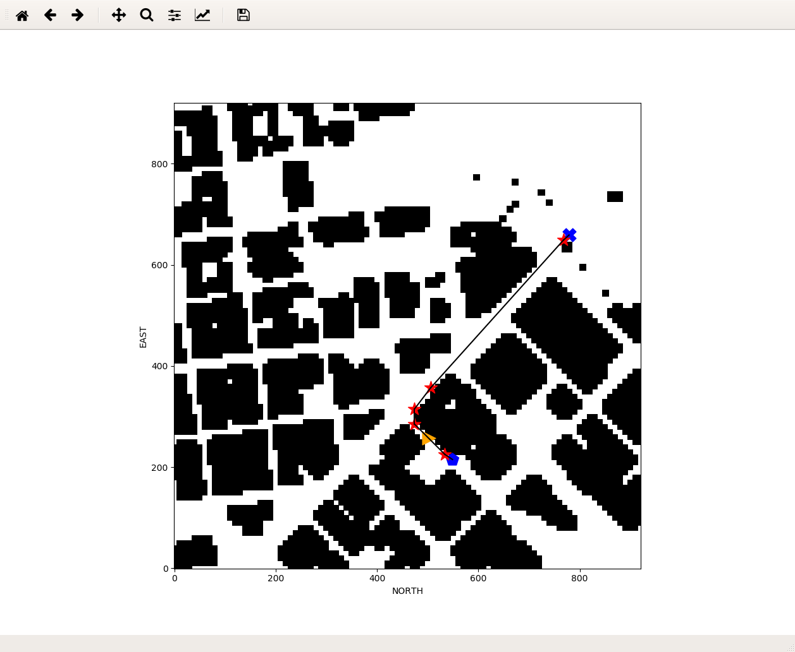
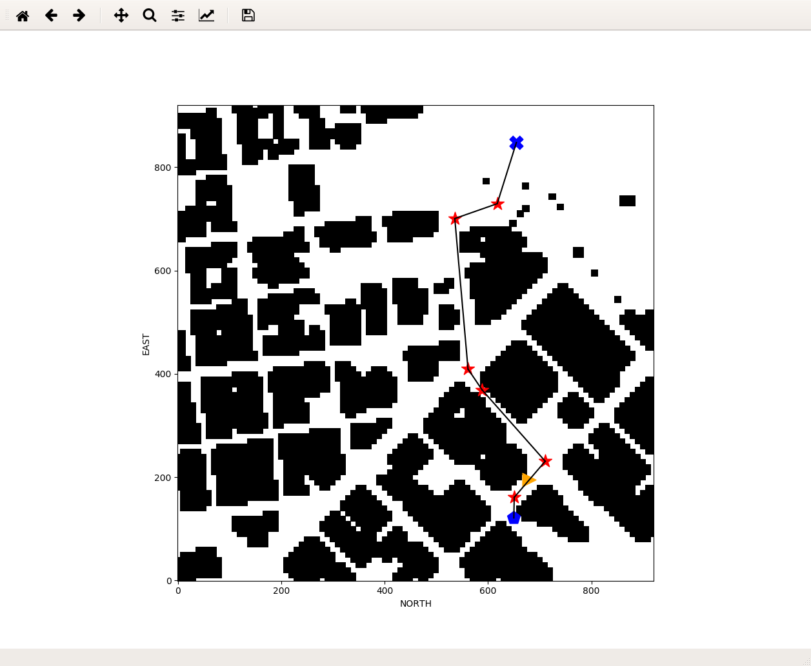
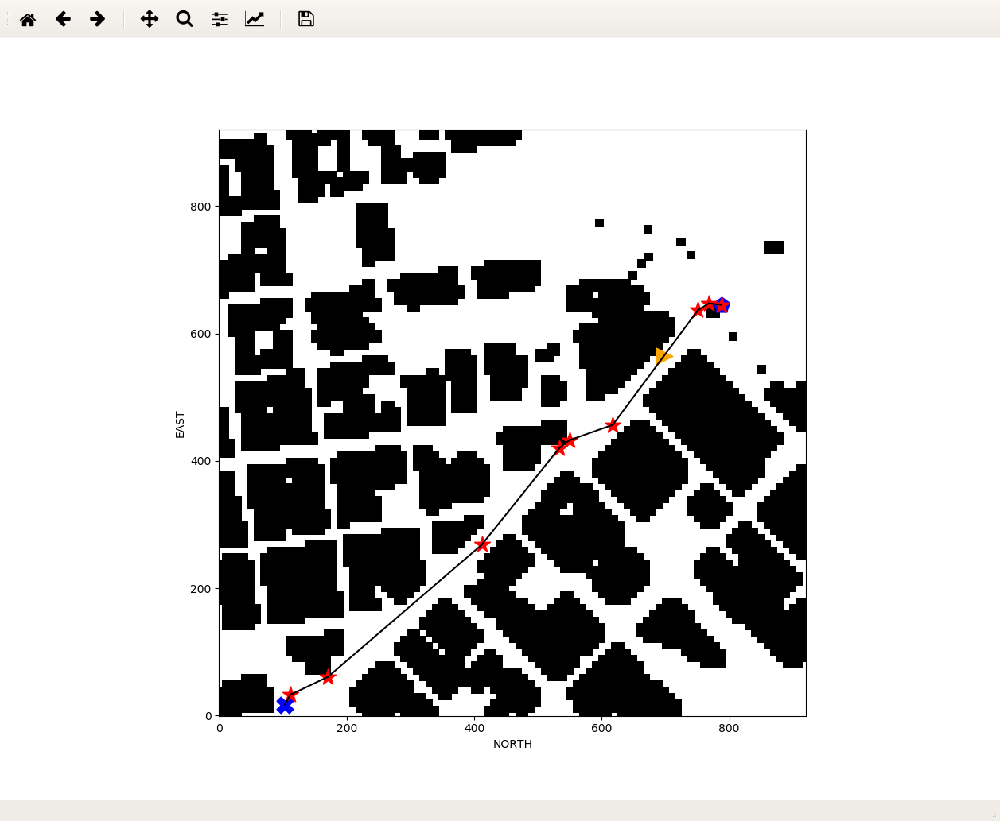
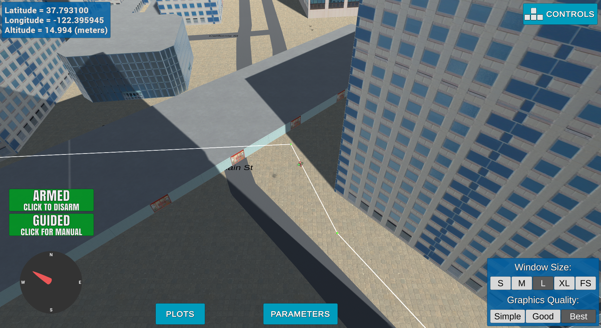
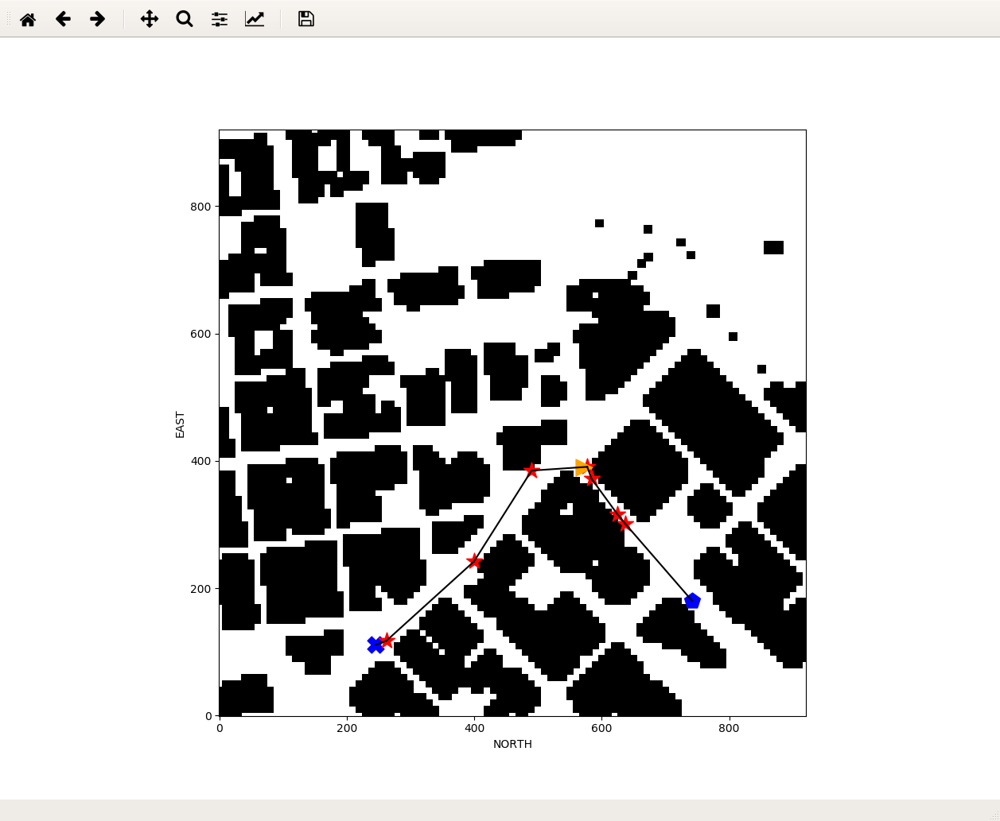

# Starter Code:
The started code tries to find a path between the start point (grid center) and
a goal point at `(+10, +10)` using the A\* (a_star) search algorithm.
The implementation of the A\* search algorithm in
 calculates a cost using a heuristic
function on a **restricted** action list: (North, South, West and East).
Therefor diagonal actions (ex: North-West) which may have a lower cost
(`sqrt(2)` instead of +2 for North+West) are not included, and this lead to a
zig-zaggy movement.

# Path Planning Algorithm
## Home Location:
The code to  location from
`colliders.csv` and set it as global home in the udacidrone API is:
```python
        pattern = 'lat0 (-?\d+\.\d+), lon0 (-?\d+\.\d+)'
        with open('colliders.csv', 'r') as f:
            firstline = f.readline()
        match = re.search(pattern, firstline)
        lat0 = float(match[1])
        lon0 = float(match[2])

        # DONE: set home position to (lon0, lat0, 0)
        self.set_home_position(lon0, lat0, 0)
```

which tries to parse a pattern on the first line of `colliders.csv` file and
uses `Drone::set_home_position()` udacidrone API to set it as the global home
location.

## Takeoff from anywhere
The  is determined directly by
providing the `self.global_position` variable to `Drone::global_to_local()` API:
```python
	current_position = global_to_local(self.global_position, self.global_home)
```

## Start point
The start point is changed from the default center of the grid to be set on the
current local position. Thus we can have a new start point by:
  - Manually navigating to an arbitrary point before launching the
    `motion_planning.py` program.
  - Start from a previously set goal point on a previous `motion-planning.py`
    mission.

The code of the  setup:
```python
        start = (int(current_position[0]), int(current_position[1]), 0)
        grid_start = self.local_to_grid(start)
```

## Goal point
The goal point setup was modified to be set on an arbitrary point:
  - Provided in the command line :
```python
    parser.add_argument('--goal', type=str, default=None, help="Global goal location, i.e. '-122.397970, 37.795090, 26.190'")
```

  - Or  a goal poistion on a free
    (non-obstacle) point in the grid:
```python
        # generate a goal randomly if not provided as argument
        if not self.global_goal:
            print("\tCannot parse global goal, generate it randomly!")
            maxn, maxe = self.grid.shape
            while True:
                n = np.random.randint(maxn)
                e = np.random.randint(maxe)
                if self.grid[n, e] == False:
                    grid_goal = (n, e)
                    break

            goal  = self.grid_to_local(grid_goal)
        else:
            print("\tglobal_goal:",self.global_goal)
            goal = global_to_local(self.global_goal, self.global_home)
            grid_goal  = self.local_to_grid(goal
```

## Search algorithm
For the planning search algorithms, I've tried to implement different ones. It
is worth mentionning that the search algorithm function is spawned in a separate
thread as it may take a lot of time to return, and this may lead to a connection
hang with the simulator due to a hard-coded timeout within the simulator itself.
Please comment out the corresponding line in 
to enable a given search algorithm:
```python
            # Choose one of the following planning algorithm:
            # 1. A* star algorithm applied to the grid.
            #path = self.myplan_grid(start, goal)

            # 2. Probabilistic Roadmap algorithm.
            #path = self.myplan_pr(start, goal)

            # 3. A* star algorithm applied to a graph.
            #path = self.myplan_graph(start, goal)

            # 4. RRT algorithm.
            path = self.myplan_rrt(start, goal)

            # 5. Receding Horizon algorithm.
            #path = self.myplan_rh(start, goal)
```

### A\* star Grid search:
The  function extend the provided
implementation of A\* star Grid search to include
 of cost `sqrt(2)` NWEST, NEAST,
SWEST, SEAST:
```python
    NWEST = (-1, -1, np.sqrt(2))
    NEAST = (-1, 1, np.sqrt(2))
    SWEST = (1, -1, np.sqrt(2))
    SEAST = (1, 1, np.sqrt(2))
```

Therefor the `(+10, +10)` goal plan will no more have zig-zaggy motion.


 -  is the new name of the `a_star()`
   provided function.

### Voronoi Graph Search
Implemented in  function,
the Voronoi Graph search algorithm gives satisfying but not optimal results as
it takes significant time to compute a path (20 to 40 seconds).

This algorithm uses some implementations developed during the course exercises:

 -  to create a graph edges
   using NetworkX graphs.
 -  is a modified A\* grid algorithm
   to work with NetworkX graphs.

### Probabilistic Roadmap algorithm
I tried to implement the Probabilistic Roadmap algorithm in
 but unfortunately, it takes a very long
time to sample random points, to create the graph and to search for a path
using A\* algorithm for graphs.

The implementation is based on the code used in the course exercises:
 -  class: which randomly sample nodes using KDTree.
 -  creates a graph using NetworkX graphs.
 -  modified A\* grid algorithm to
    work with NetworkX graphs.

### Receding Horizon
I also tried to implement the Receding Horizon in
, which uses the A\* grid planning to
find a global 2D coarse plan and then generate a local 3D path on each waypoint.
However, unfortunately, the local path is not optimal, as it takes a lot of time
to generate the local (40,40,10) 3D voxmap.
 - : 3D local planning entrypoint.
 - : Function which create the
   3D voxmap.
 - : Function to detect the point on the
   edge of the local 3D cube toward the next waypoint.
 - : used to compute the global 2D path.
 - : used to compute the local 3D path.

### RRT search
The RRT search algorithm implemented in 
gives the most satisfactory and computation efficiency results.

The implementation is derived from code used in the course exercises in addition
to a trick which biases the tree generation toward the goal point in 10% of the
calls, which may reduce the planning computation time.
 -  class: which implements RRT tree using NX DiGraph.
 - : which generates the RRT tree starting
   from the start point toward the goal point.
 -  to calculate the shortest path
   from the nearest node of the start point to a nearest node of the goal point.

### Waypoints Cull
The Breseham method was used to  unnecessary
waypoints between 2 obstacles in both directions: one way from start point to
goal, and then the way back to the start.

# Flight Execution
## colliders map
As there is a mismatch between the colliders map and actual buildings in the
scene of the simulator, I've changed the  file
to a new one generated (by hitting MAJ-S) from the latest FCND-Simulator
version to date (v0.1.1-sim).

## Goal and Start points.
As said before, if not provided in the command line the goal point will
be set randomly to a free (non-obstacle) point in the grid.

## Deadband
I've set the  to 2 times the safety_distance
in order to allow smooth transitions through waypoints up to the last one where
the deadband is set to 0.1, to land precisely in the goal point.

## Flight Altitude
If the planning process failed to find a path, it will
 by +10, and retry again.

## Heading
The  of drone is set along the target
position command by:
```python
        heading = np.arctan2(self.target_position[1] - self.local_position[1],
                             self.target_position[0] - self.local_position[0])
        self.cmd_position(self.target_position[0], self.target_position[1], self.target_position[2], heading)
```



## Gridisplay.
A 2D map (grid) live map using matplotlib is displaying in parallel the grid
as a 2D map to show the current live position of the drone, the computed path
and the start and goal points.

This grid displayer is launched in a separate process, and the code is located
in a separate file 

### Grid view example1

### Grid view example2

### Grid view example3


## Example of flight plan



### Example of console output

```
 $ python motion_planning.py
Gridisplay started ...
Logs/TLog.txt
Logs/NavLog.txt
starting connection
arming transition
        Global home [-122.3974533   37.7924804    0.       ]
        Global position [-122.3935271   37.7954334    0.236    ]
        local position [ 3.28147369e+02  3.48917053e+02 -2.38445044e-01]
Loading obstacle map grid ...
        North offset = -316, east offset = -445
        Cannot parse global goal, generate it randomly!
        Local Start and Goal:  (329, 343, 0) (-299, -342, 15)
        Grid Start and Goal:  (645, 788) (17, 103)
Initialize Gridisplay ...
        Show grid
        Show start and goal points
Searching for a path ...
        Using RRT algorithm
        Path found!
        Prune path from 53 to 11
        Prune path from 11 to 10
         11 [(645, 788), (645, 788), (647.3515745207902, 768.1387287095421), (636.8460490336412, 751.1200937983965), (456.57821951882556, 617.3432117577887)
, (432.40468854989786, 549.1858434268848), (420.0766721125942, 533.4371923506317), (268.1134470750655, 411.7039519050492), (60.69231064617442, 170.366669147
25606), (32.34201440978713, 110.98023379336999), (17, 103)]
        Planning process took 3.719701051712036 seconds ...
Sending waypoints to simulator ...
Update Gridisplay ...
        add edges
        add points
takeoff transition
waypoint transition
        target position (329, 343, 15, 0)
waypoint transition
        target position (329, 343, 15, 0)
waypoint transition
        target position (331, 323, 15, 0)
waypoint transition
        target position (320, 306, 15, 0)
waypoint transition
        target position (140, 172, 15, 0)
waypoint transition
        target position (116, 104, 15, 0)
waypoint transition
        target position (104, 88, 15, 0)
waypoint transition
        target position (-47, -33, 15, 0)
waypoint transition
        target position (-255, -274, 15, 0)
waypoint transition
        target position (-283, -334, 15, 0)
waypoint transition
        target position (-299, -342, 15, 0)
landing transition
disarm transition
manual transition
Closing connection ...
```

